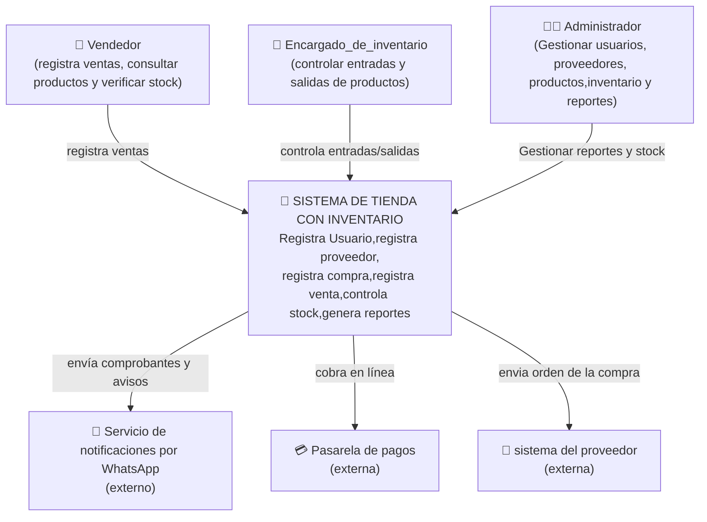

# C4 del caso sistema de tienda con inventario

# Nivel 1 (el sistema y su mundo)

```mermaid
flowchart TB
    vendedor["👤 Vendedor<br>(registra ventas, consultar productos y verificar stock)"]
    administrador["🧑‍💼 Administrador<br>(Gestionar usuarios, proveedores, productos,inventario y reportes)"]
    encargado["👤 Encargado_de_inventario<br>(controlar entradas y salidas de productos)"]
    sistema["🏪 SISTEMA DE TIENDA CON INVENTARIO<br>Registra Usuario,registra proveedor,
registra compra,registra venta,controla stock,genera reportes"]
    notificacion["🔔 Servicio de notificaciones por WhatsApp<br>(externo)"]
    pasarela["💳 Pasarela de pagos<br>(externa)"]
    proveedor["🚚 sistema del proveedor<br>(externa)"]
    vendedor -->|"registra ventas"| sistema
    encargado -->|"controla entradas/salidas"| sistema
    administrador -->|"Gestionar reportes y stock"| sistema
    sistema -->|"envía comprobantes y avisos"| notificacion
    sistema -->|"cobra en línea"| pasarela
    sistema -->|"envia orden de la compra"| proveedor
```
