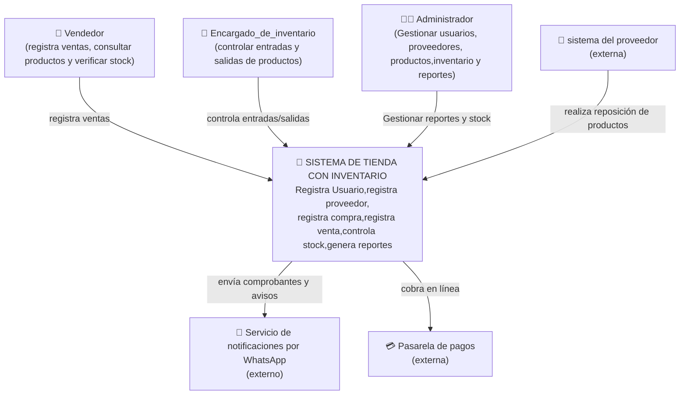
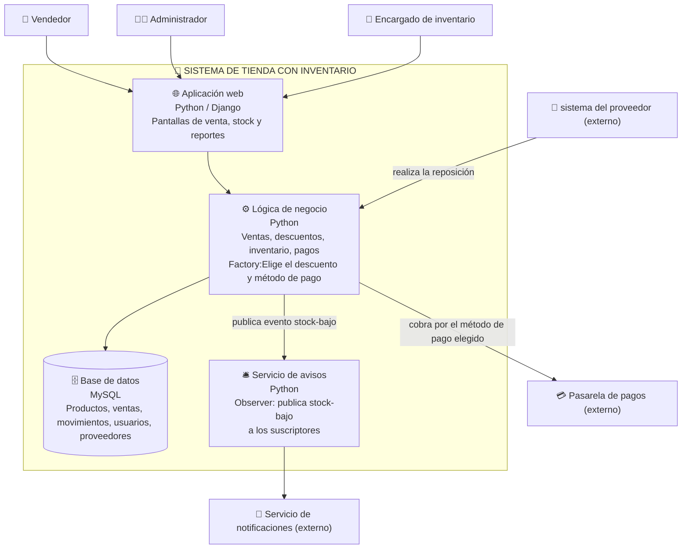

# C4 del caso sistema de tienda con inventario

# Nivel 1 - Contexto (el sistema y su mundo)  
¿quién usa el sistema y con qué otros sistemas habla?
- Principalmente lo usan el vendedor, para registrar las ventas y cobrar a los clientes; el administrador, para gestionar productos, usuarios y reportes; y el encargado de inventario, para controlar las existencias, entradas, salidas y niveles de stock. 
- El sistema se comunica con una pasarela de pagos para procesar pagos electrónicos, con un sistema del proveedor para apoyar la reposición de productos, y con un servicio de notificaciones para enviar avisos por WhatsApp.

# Nivel 2 — Contenedores (el zoom adentro del sistema)  
¿de qué piezas ejecutables/almacenes está hecho el sistema?
- Las piezas ejecutables son la Aplicación Web, que interactúa con el sistema; la Lógica de Negocio; el Servicio de Avisos, que genera notificaciones y una base de datos MySQL.

